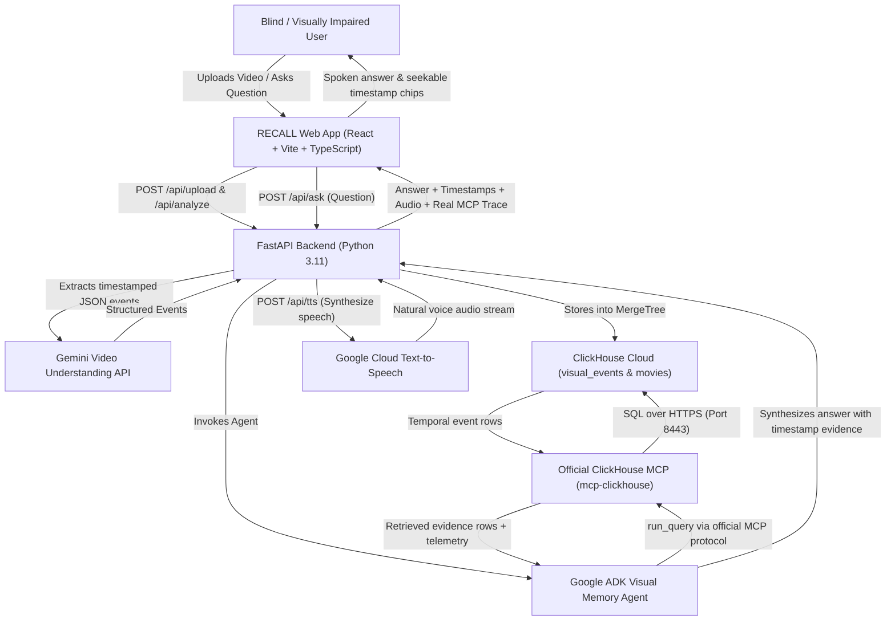

# RECALL: Persistent Visual Memory for Media

> **Ask what happened, not just what is happening.**  
> Built for the **Agentic Cinema** Hackathon.

[](LICENSE)
[](https://ai.google.dev/)
[](https://clickhouse.com/)
[](https://github.com/ClickHouse/mcp-clickhouse)

---

## 1. Problem Statement

Existing accessibility tools often describe whatever pixels are visible *right now*. For blind and visually impaired users watching film or narrative media, this means losing temporal continuity:
- *"Where did she put that letter?"*
- *"Who took it off the table?"*
- *"Where did it end up?"*
- *"What changed in the room after he left?"*

Live descriptive audio cannot easily rewind to reconstruct who moved what object, when it was concealed, or how room states evolved across scenes.

## 2. Solution

**RECALL** transforms video into an accessible, persistent **temporal visual memory**:
1. **Video Ingestion & Event Extraction**: Google Gemini analyzes video clips, extracting objective, timestamped visual events into strict JSON.
2. **Temporal Memory Store**: Events are indexed in **ClickHouse Cloud** using optimized `MergeTree` tables with character/object array indexing.
3. **Agentic MCP Retrieval**: When the user asks a natural-language question, a **Google ADK Agent** autonomously executes targeted read-only SQL queries via the official **ClickHouse MCP server (`mcp-clickhouse`)**.
4. **Temporal Reasoning & Voice Delivery**: Gemini reasons across time (`first`, `after`, `last`, `still`, `no longer`) to provide a concise answer, cited with clickable timestamps that jump the video player to that exact second, and read aloud using **Google Text-to-Speech**.

---

## 3. Architecture



---

## 4. Google Cloud, Gemini & ClickHouse MCP Usage

### Google Gemini & Google Cloud
- **Video Understanding (`gemini-2.0-flash`)**: Extracts objective, timestamped visual events (`event_id`, `start_seconds`, `end_seconds`, `characters`, `objects`, `location`, `action`, `visual_description`, `confidence`) using the official `google-genai` SDK and File API.
- **Agentic Temporal Reasoning**: Google ADK agent equipped with the ClickHouse MCP tool layer to formulate schema-aware SQL and reason across multi-event timelines.
- **Google Cloud Text-to-Speech**: Delivers natural spoken responses for screen-reader and voice navigation.
- **Cloud Run Deployment**: Containerized with multi-stage Docker and Secret Manager.

### ClickHouse Cloud
- Stores the temporal visual memory in a high-performance `visual_events` table using `ENGINE = MergeTree() ORDER BY (movie_id, start_seconds, event_id)`.
- Array columns (`Array(String)`) for `characters` and `objects` enable fast `has(objects, 'brown envelope')` queries.

### Official ClickHouse MCP Server (`mcp-clickhouse`)
- The agent communicates with ClickHouse **exclusively via the official MCP server** (`mcp-clickhouse`).
- Exposes `run_query`, `list_tables`, and `list_databases` in safe read-only mode over stdio.
- Genuine execution telemetry (SQL statement, latency in ms, rows returned) is displayed in the developer trace drawer.

---

## 5. Quickstart & Local Setup

### Prerequisites
- Python 3.11+
- Node.js 20+ & npm
- FFmpeg (for sample video generation)

### Installation
```bash
# 1. Clone repository & enter directory
git clone https://github.com/your-username/recall.git
cd recall

# 2. Configure environment variables
cp .env.example .env
# Edit .env with your GEMINI_API_KEY and ClickHouse Cloud credentials

# 3. Install Python dependencies
python3 -m venv venv
./venv/bin/pip install -r backend/requirements.txt pillow

# 4. Install Frontend dependencies
cd frontend && npm install && cd ..

# 5. Generate benchmark video & seed demo data
./venv/bin/python scripts/generate_sample_video.py
./venv/bin/python scripts/seed_demo_data.py
```

### Running RECALL
```bash
# Option A: Run everything with the development runner
./scripts/run_dev.sh

# Option B: Run individually
# Terminal 1 (Backend):
PYTHONPATH=. ./venv/bin/uvicorn backend.app.main:app --port 8000 --reload

# Terminal 2 (Frontend):
cd frontend && npm run dev
```

Open `http://localhost:5173` in your browser.

---

## 6. Judges Demo Walkthrough

1. **Load Benchmark Dataset**: Click the **"Load Mystery Demo"** button in the header.
   - The UI loads the 75-second benchmark scene: *"The Kitchen Hand-off"*.
   - 20 structured events are loaded into ClickHouse Cloud.
   - The ClickHouse status badge updates: **`ClickHouse: 20 Visual Events`**.
2. **Ask Temporal Questions**:
   Click any preset question chip or type a question:
   - *"Where was the envelope first placed?"*  
     ↳ **Answer**: *"The brown envelope was first seen at 00:07 on the kitchen dining table when Maya placed it there."*
   - *"Who moved the envelope?"*  
     ↳ **Answer**: *"Daniel picked up the brown envelope from the table at 00:19."*
   - *"Where did it end up?"*  
     ↳ **Answer**: *"The envelope ended up hidden inside the top-right cabinet drawer. Daniel put it there at 00:38 and shut the drawer, where Sofia later discovered it at 01:05."*
   - *"What changed after Maya left?"*  
     ↳ **Answer**: *"After Maya exited into the hallway at 00:23, Daniel hid the brown envelope inside the top-right cabinet drawer, left through the back door, and Sofia entered the kitchen carrying a mug."*
3. **Verify Clickable Timestamps**:
   - In the answer card, click the **`00:38 • Daniel places envelope inside drawer`** evidence chip.
   - Notice the video player immediately seeks to 00:38, highlighting the cabinet drawer state.
4. **Listen to Spoken Answer**:
   - Click **"Read Answer Aloud"** to hear the spoken response via Google TTS.
5. **Inspect the Architecture Trace Drawer**:
   - Click **"Trace Drawer"** in the top right.
   - Observe the live MCP trace: `mcp_tool="run_query"`, the exact SQL query executed, execution latency in milliseconds, and row counts returned.

---

## 7. Accessibility Design

- **WCAG AAA High-Contrast Palette**: Deep slate background (`#070B14`), electric cyan (`#38BDF8`), luminous amber (`#F59E0B`), and crisp white text (`#F8FAFC`).
- **Keyboard Navigation**: Full tab sequence support with prominent `3px solid #38BDF8` focus rings.
- **Screen Reader Announcements**: Always-visible `aria-live="polite"` status region announcing:
  - *"Analyzing video"*
  - *"Memory ready: 20 visual events stored in ClickHouse"*
  - *"Searching visual memory via ClickHouse MCP..."*
  - *"Answer ready"*
- **Auto-Read Mode**: Optional setting for blind users to automatically speak answers aloud upon completion.

---

## 8. Limitations & Future Work

- **Short Video MVP**: Optimized for 60-90 second narrative scenes. Feature films will benefit from hierarchical scene chunking.
- **Analysis Latency**: Gemini video understanding requires 5-15 seconds of initial ingestion time. ClickHouse MCP queries execute in <50ms.
- **Visual Ambiguity**: Subtle off-screen actions or occluded objects require higher confidence thresholds.
- **Real-World Perception**: Designed as a cognitive memory aide for media, not a safety-critical real-time navigation assistant.

---

## 9. License

This project is open source and licensed under the [Apache License 2.0](LICENSE).
