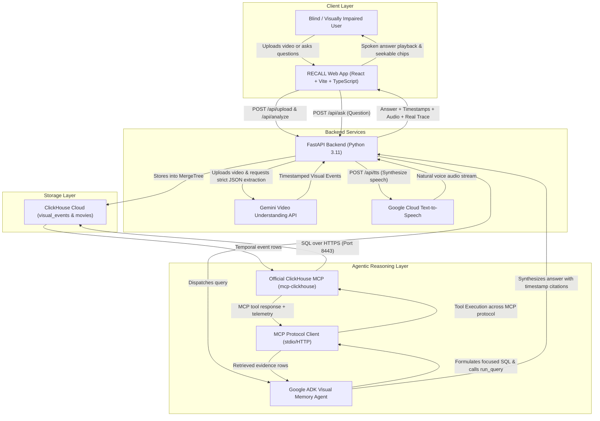

# RECALL Architecture

> **Persistent Visual Memory for Media**  
> Built for the *Agentic Cinema* Hackathon.

RECALL enables blind and visually impaired individuals to interrogate video media across time. Instead of merely describing whatever pixels are currently in front of a camera, RECALL constructs a persistent, structured temporal memory in **ClickHouse Cloud**, queryable on-demand via a **Google ADK Agent** connected through the official **ClickHouse MCP Server (`mcp-clickhouse`)**.

---

## 1. System Architecture

---

## 2. Core Components

### 2.1 Video Understanding (Google Gemini)
- Uploads video using the Google GenAI File API.
- Extracts visual facts as strict, validated Pydantic JSON:
  - `start_seconds`, `end_seconds`
  - `characters` (Array of Strings)
  - `objects` (Array of Strings)
  - `location`, `action`, `visual_description`, `confidence`
- Strict prompt constraints prevent hallucinations and prioritize physical state changes, object placements, and entrances/exits.

### 2.2 Temporal Memory Store (ClickHouse Cloud)
- Events are persisted into a dedicated `visual_events` table using ClickHouse's high-performance `MergeTree` engine ordered by `(movie_id, start_seconds, event_id)`.
- Array support (`Array(String)`) enables lightning-fast `has(objects, 'brown envelope')` and `has(characters, 'Daniel')` queries.

### 2.3 Agentic Tool Layer (Official ClickHouse MCP Server)
- The agent does **not** use custom direct database queries. Instead, it utilizes the official **`mcp-clickhouse`** server.
- Supported MCP tools:
  - `run_query`: Read-only execution of ClickHouse SQL.
  - `list_tables`: Schema inspection.
  - `list_databases`: Database catalog listing.
- Telemetry (exact SQL query, execution latency in milliseconds, row count) is captured from the real MCP tool invocation and displayed in the developer trace drawer.

### 2.4 Spoken Accessibility & UI
- High contrast WCAG AAA interface with visible focus outlines and screen-reader announcements via `aria-live="polite"`.
- Clicking any timestamp evidence chip instantly seeks the HTML5 media player to the exact second in the movie.
- Speech playback powered by Google Cloud Text-to-Speech (`en-US-Journey-F`).
